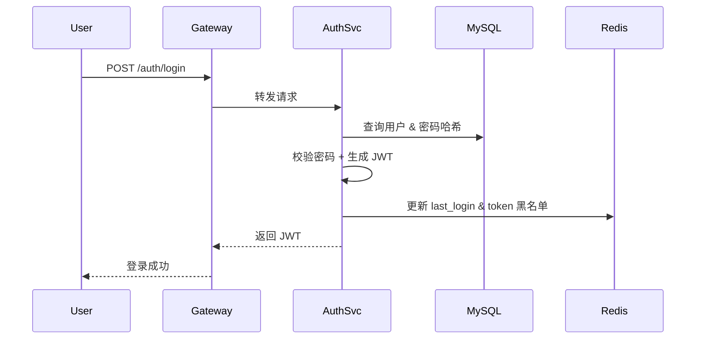
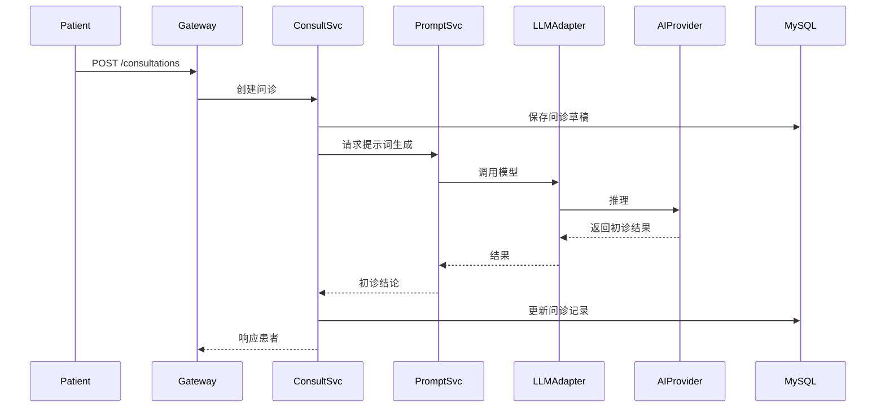
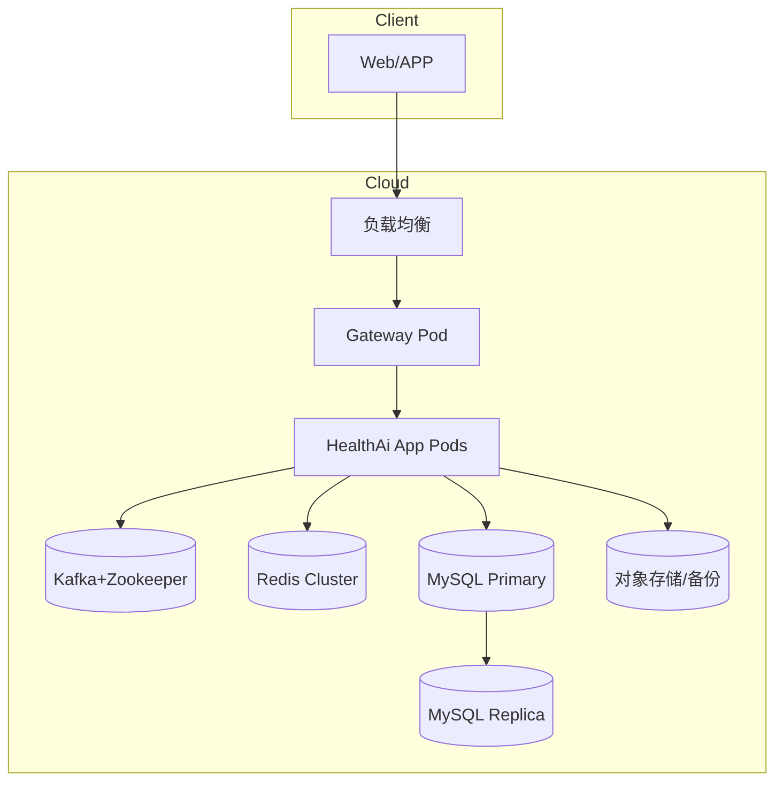

# HealthAi 系统架构设计

## 1. 架构目标
- **一致性**：统一入口与安全策略，确保患者数据可靠传输。
- **扩展性**：通过模块化/微服务演进，逐步拆分问诊、指标等高负载模块。
- **高可用**：利用缓存、消息队列与监控手段提升服务稳定性。
- **易集成**：与多家大模型服务商、第三方医疗系统灵活对接。

## 2. 逻辑架构
```mermaid
diagram LR
    subgraph Client
        PWA[患者 Web/APP]
        Admin[后台运营]
    end

    subgraph Edge
        WAF[WAF/反向代理]
        GW[API Gateway (Spring Cloud Gateway)]
    end

    subgraph ServiceLayer
        AuthSvc[身份与权限模块]
        ProfileSvc[健康档案模块]
        VitalSvc[生理指标模块]
        ConsultSvc[问诊模块]
        DrugSvc[药品库模块]
        RxSvc[处方模块]
        NotificationSvc[通知&告警]
    end

    subgraph AIPlatform
        PromptSvc[Prompt Engine]
        LLMAdapter[LLM Provider Adapter]
        Ollama[Ollama Runtime]
        ProviderAPI[第三方模型 API]
    end

    subgraph DataLayer
        MySQL[(MySQL Cluster)]
        Redis[(Redis Cluster)]
        Kafka[(Kafka Cluster)]
        ZK[(Zookeeper)]
        ObjectStore[(对象存储/OSS)]
    end

    subgraph Observability
        Log[日志收集 (ELK)]
        Metrics[指标 (Prometheus/Grafana)]
        Trace[链路追踪 (SkyWalking/OpenTelemetry)]
    end

    PWA --> WAF --> GW
    Admin --> WAF
    GW --> AuthSvc
    GW --> ProfileSvc
    GW --> VitalSvc
    GW --> ConsultSvc
    GW --> DrugSvc
    GW --> RxSvc
    VitalSvc --> NotificationSvc

    ConsultSvc --> PromptSvc --> LLMAdapter
    LLMAdapter --> Ollama
    LLMAdapter --> ProviderAPI

    AuthSvc --> Redis
    ProfileSvc --> MySQL
    VitalSvc --> MySQL
    VitalSvc --> Kafka
    ConsultSvc --> MySQL
    DrugSvc --> MySQL
    RxSvc --> MySQL
    Kafka --> ZK
    ConsultSvc --> ObjectStore

    ServiceLayer --> Log
    ServiceLayer --> Metrics
    ServiceLayer --> Trace
```

## 3. 模块职责划分
| 模块 | 主要职责 | 关键交互 |
| --- | --- | --- |
| `AuthSvc` | 注册登录、JWT 认证、角色权限、密码加密 | Redis、Gateway、审计日志 |
| `ProfileSvc` | 健康档案 CRUD、档案版本、对外档案接口 | MySQL、ConsultSvc |
| `VitalSvc` | 生理指标采集、阈值告警、趋势分析 | Kafka、NotificationSvc、Redis |
| `ConsultSvc` | 问诊工单、AI 推理、Doctor Review | PromptSvc、MySQL、RxSvc |
| `DrugSvc` | 药品库维护、禁忌症校验、搜索 | MySQL、RxSvc |
| `RxSvc` | 处方开具、明细、审计日志 | MySQL、ConsultSvc |
| `PromptSvc` | 提示词管理、上下文拼装、多模型策略 | Ollama、第三方模型 API |
| `NotificationSvc` | 告警、短信/邮件、WebSocket 推送 | Redis、Kafka |

初期采用 **模块化单体 (Modular Monolith)**，按业务模块拆分 package。未来可将 `ConsultSvc`、`VitalSvc` 等拆分为独立微服务。

## 4. 核心流程

### 4.1 用户登录


### 4.2 AI 问诊


## 5. 数据与集成策略
- **数据库访问**：MyBatis + Mapper XML；按模块创建独立的 `repository` 包及表对应实体。
- **缓存策略**：Redis 存储会话、验证码、热门药品缓存、指标阈值数据；设置 TTL 与失效通知。
- **消息流**：
  - `VitalSvc` 将指标异常事件推送至 Kafka `healthai.vitals.alerts`。
  - `ConsultSvc` 发布问诊状态变化 `healthai.consult.status` 供通知与分析使用。
- **AI 服务适配**：`LLMAdapter` 抽象 REST/SDK 调用，支持 `Ollama`、DeepSeek、硅基流动等；配置驱动选择。
- **外部对接**：预留接口与医院 HIS/EMR、保险等系统集成，通过 API 或消息队列实现。

## 6. 部署拓扑


- **环境区分**：`dev` 使用 Docker Compose；`test` 使用 H2；`prod` 部署于 K8s/云主机。
- **高可用**：生产环境启用主从 MySQL、Redis Sentinel/Cluster、Kafka 多 Broker。
- **CI/CD**：GitHub Actions 构建 + 单元测试，部署到测试环境，人工审批后进入生产。

## 7. 安全与合规
- **身份安全**：JWT + Refresh Token，Spring Security 配置 RBAC；敏感信息加密存储。
- **数据合规**：对外接口进行审计日志记录；敏感字段（病史、处方）落库加密；实现数据脱敏与授权访问。
- **传输安全**：全站 HTTPS，服务间通信走 mTLS 或专有网络。
- **合规要求**：遵循《中华人民共和国网络安全法》等医疗数据保护法规；建立数据访问审批流程。

## 8. 运维与监控
- **日志**：统一输出 JSON 日志，Logback -> Filebeat -> Elasticsearch。
- **指标**：暴露 Micrometer 指标到 Prometheus；重点关注响应时间、错误率、Kafka lag。
- **告警**：配置 Alertmanager/企业微信通知；数据库容量、队列堆积、AI 推理失败等阈值。
- **自动化**：使用 Terraform/Helm 管理基础设施；备份与灾难恢复策略（每日全量、每小时增量）。

## 9. 演进路线
1. Sprint 1：模块化单体 + MyBatis，实现用户 & 档案模块。
2. Sprint 2：引入 Kafka 流程，完成生理指标模块与阈值告警。
3. Sprint 3：集成 AI 问诊，打通 PromptSvc 与多模型适配层。
4. Sprint 4：完善药品 & 处方、审计日志、性能优化。
5. 后续：按模块拆分微服务，引入 API Gateway 与服务网格，扩展对接第三方医疗系统。
