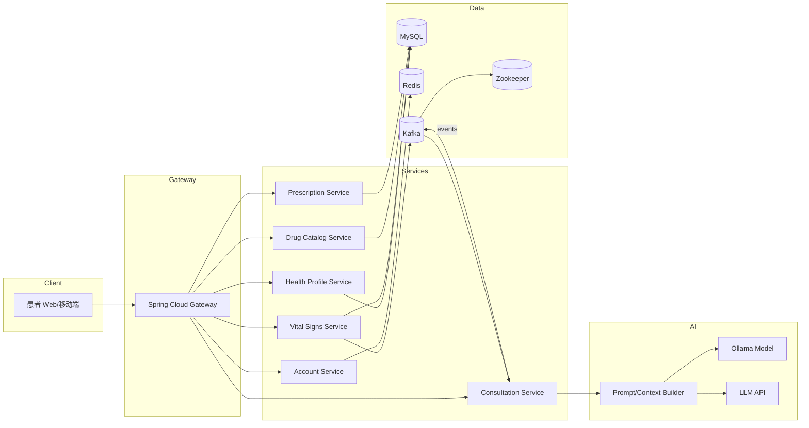
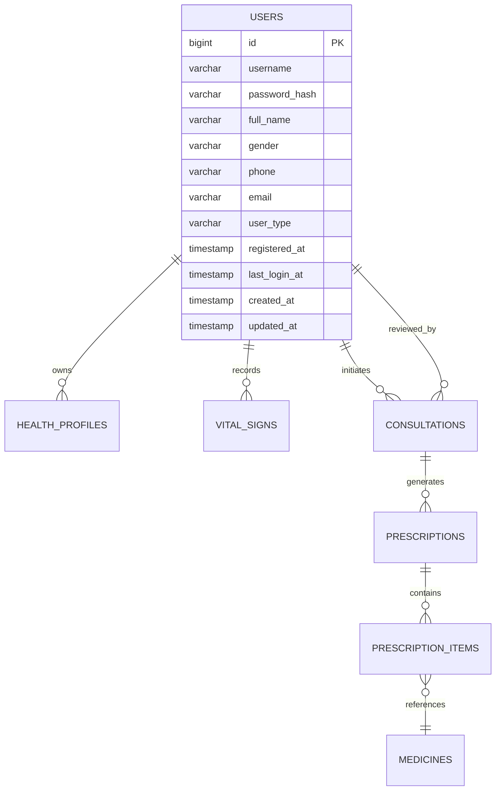

# HealthAi 项目蓝图

## 项目概述
HealthAi 面向 **患者端** 提供一体化的 AI 辅助医疗服务，构建覆盖账号管理、健康档案、生理指标监测、问诊记录、药品管理与处方开具的端到端解决方案。系统需兼容本地 `Ollama` 与外部大模型 API，通过 Spring 生态实现安全、可扩展的企业级后端能力。

## 2025-10-29 进度速记
- **安全链路**：更新 `SecurityConfig` 禁用匿名访问并自定义 `authenticationEntryPoint`，未授权访问统一返回 HTTP 401。
- **集成测试稳定性**：在 `TestRedisConfiguration` 提供 `PromptService`、`AuditTrailService` 测试桩，并在 `ConsultationControllerIntegrationTest` 中通过 `@MockBean KafkaTemplate` 与 `CompletableFuture` 屏蔽真实 Kafka 依赖，修复 500 超时与 403 校验失败问题。
- **AI 问诊主干**：落地 `ConsultationService`、`ConsultationController`、`PromptService` 与 `OllamaLlmClient`，打通问诊创建、AI 初诊、医生复核流程，Kafka 事件、审计日志与提示词渲染协同工作。
- **文档计划调整**：Sprint 2 未完测试/运维文档与秘钥 Runbook 转入 Sprint 3 Backlog，确保迭代聚焦问诊体验。

## 总体目标
- **临床辅助**：以 AI 初诊 + 医生复核的流程提升问诊效率，降低漏诊风险。
- **健康管理**：帮助患者实时掌握生理指标趋势，获得个性化健康建议。
- **药品合规**：提供权威药品库和处方流程，保障用药安全。

## 目标用户与场景
- **患者**：自助管理健康档案、上传生理指标、发起 AI 问诊、查看处方。
- **医生/审核员**（后续迭代扩展）：审核 AI 诊断、提供最终意见、开具处方。
- **系统管理员**（后续迭代）：维护药品库与系统配置。

## 功能需求分析

### 1. 用户账号模块
- **概述**：支持用户注册、登录、角色划分与安全管理。
- **核心字段**：`user_id`、`login_name`、`password_hash`、`user_type`（patient/doctor/admin）、`registered_at`、`last_login_at`。
- **功能点**：
  - 用户注册与登录（基于 Spring Security + JWT）。
  - 密码加密存储（BCrypt）。
  - 登录审计与最后登录时间更新。
  - 可扩展的角色-权限模型。

### 2. 健康档案模块
- **核心字段**：`record_id`、`user_id`、`birth_date`、`blood_type`、`chronic_diseases`、`allergy_history`、`genetic_risk`。
- **功能点**：
  - 创建/更新个人健康档案。
  - 记录慢性病、过敏史、遗传病风险。
  - 提供档案版本变更记录（后续迭代）。

### 3. 生理指标模块
- **核心字段**：`vital_id`、`user_id`、`measured_at`、`heart_rate`、`blood_pressure`、`temperature`、`spo2`、`weight`。
- **功能点**：
  - 手动录入或设备同步生理指标。
  - 指标阈值告警（结合 Redis + Kafka 实现实时处理）。
  - 指标趋势分析与可视化（后续前端需求）。

### 4. 问诊记录模块
- **核心字段**：`consult_id`、`user_id`、`symptom_desc`、`ai_diagnosis`、`doctor_review`、`status`（draft/ai_reviewed/doctor_reviewed/closed）、`created_at`。
- **功能点**：
  - 患者发起问诊，AI 给出初诊结论。
  - 医生复核与意见补充。
  - 状态流转与审计日志。
  - 与 LLM 服务解耦的提示词模板管理。

### 5. 药品库模块
- **核心字段**：`drug_id`、`generic_name`、`indications`、`contraindications`、`dosage`、`drug_interactions`。
- **功能点**：
  - 药品信息维护与搜索。
  - 支持药品禁忌症检查。
  - 可扩展至外部权威数据对接。

### 6. 处方记录模块
- **核心字段**：`prescription_id`、`consult_id`、`drug_id`、`dosage_instruction`、`days`、`doctor_notes`。
- **功能点**：
  - 与问诊记录联动生成处方。
  - 多药品组合与医嘱备注。
  - 处方审核记录与导出。

## 用例与业务流程
- **UC-01 注册与登录**：患者注册 → 系统发送验证 → 登录 → 获取 Token。
- **UC-02 健康档案维护**：患者填写/更新档案 → 系统存储并供问诊调用。
- **UC-03 生理指标上报**：患者录入指标 → 系统校验 → 保存 → 阈值触发消息 → 通知患者或医生。
- **UC-04 AI 问诊**：患者提交症状 → AI 模型推理 → 返回初诊 → 患者确认/补充信息 → 医生复核（可选）。
- **UC-05 处方生成**：医生复核通过 → 根据药品库生成处方 → 患者查看。

## 数据模型概览
| 模块 | 表 | 关键字段 |
| --- | --- | --- |
| 用户 | `users` | `user_id`, `login_name`, `password_hash`, `user_type`, `registered_at`, `last_login_at` |
| 健康档案 | `health_profiles` | `record_id`, `user_id`, `birth_date`, `blood_type`, `chronic_diseases`, `allergy_history`, `genetic_risk` |
| 生理指标 | `vital_signs` | `vital_id`, `user_id`, `measured_at`, `heart_rate`, `blood_pressure`, `temperature`, `spo2`, `weight` |
| 问诊记录 | `consultations` | `consult_id`, `user_id`, `symptom_desc`, `ai_diagnosis`, `doctor_review`, `status`, `created_at` |
| 药品库 | `drugs` | `drug_id`, `generic_name`, `indications`, `contraindications`, `dosage`, `drug_interactions` |
| 处方记录 | `prescriptions` | `prescription_id`, `consult_id`, `drug_id`, `dosage_instruction`, `days`, `doctor_notes` |

## 非功能需求
- **可用性**：核心功能 99.5% SLA；关键数据每 15 分钟备份。
- **性能**：单次问诊响应 < 3s（AI 调用除外），生理指标写入 TPS ≥ 100。
- **扩展性**：通过 Spring Cloud 模块化拆分，支持后续服务拆分与水平扩展。
- **安全性**：全链路 HTTPS；基于角色的访问控制；敏感数据加密存储；日志合规。
- **合规性**：满足基础医疗数据隐私保护要求（脱敏、访问审计）。

## 系统架构设计

### 架构概述
- **API 网关**：统一入口，负责鉴权、限流、路由。
- **应用服务层**：按功能拆分服务（账户、档案、问诊、处方、药品、指标、通知），初期采用模块化单体，后续可演进为微服务。
- **AI 推理层**：封装 `PromptSvc` 与模型适配层，支持 `Ollama` 及 DeepSeek、硅基流动等外部供应商。
- **数据层**：MySQL 存储结构化数据，Redis 作为缓存与会话存储，Kafka + Zookeeper 支持异步事件（阈值告警、问诊状态变更），对象存储沉淀问诊附件。
- **观测与运维**：接入日志/指标/链路追踪，结合 ELK、Prometheus、Grafana、SkyWalking 构建可观测性体系。

> 详细架构文档参见 `docs/architecture/system_architecture.md`。

### 架构图


### 模块职责与集成
- **AuthSvc**：注册登录、JWT、RBAC，依赖 Redis 缓存与审计日志。
- **ProfileSvc**：健康档案 CRUD，向 `ConsultSvc` 暴露档案查询接口。
- **VitalSvc**：指标采集、阈值告警，事件推送至 Kafka `healthai.vitals.alerts`，触发 `NotificationSvc`。
- **ConsultSvc**：问诊流水、AI 初诊、医生复核，与 `PromptSvc`、`RxSvc`、对象存储交互。
- **DrugSvc**：药品库维护、禁忌症校验，为 `RxSvc` 提供药品查询能力。
- **RxSvc**：处方生成、明细、审计日志，依赖 MySQL 与 `ConsultSvc`。
- **PromptSvc/LLM Adapter**：统一模型接入层，可选 `Ollama` 或第三方 REST API。
- **NotificationSvc**：短信/邮件/WebSocket 推送，适配企业微信等渠道。

### 部署拓扑（概述）
- **开发环境**：`docker-compose` 启动 MySQL、Redis、Kafka/Zookeeper；应用在本地运行。
- **测试环境**：容器化部署（K8s/Compose），引入流水线构建、自动化测试与 H2 替换。
- **生产环境**：K8s + Ingress + Service Mesh；MySQL 主从、Redis Cluster、Kafka 多 Broker，统一日志与指标平台。详细说明见 `docs/architecture/system_architecture.md`。

## 接口设计（初版）

### 用户账号
| 方法 | 路径 | 描述 | 请求体/参数 | 响应 |
| --- | --- | --- | --- | --- |
| POST | `/api/v1/auth/register` | 患者注册 | `{loginName, password, mobile, email}` | `{userId, token}` |
| POST | `/api/v1/auth/login` | 登录获取 Token | `{loginName, password}` | `{token, expiresIn}` |
| GET | `/api/v1/auth/profile` | 获取当前账号信息 | Header: `Authorization` | `{userId, userType, lastLoginAt}` |

### 健康档案
| 方法 | 路径 | 描述 | 请求体/参数 | 响应 |
| --- | --- | --- | --- | --- |
| GET | `/api/v1/health-profile` | 查询当前用户档案 | Header: `Authorization` | 档案详情 |
| POST | `/api/v1/health-profile` | 创建/更新档案 | 档案字段 | `{recordId}` |

### 生理指标
| 方法 | 路径 | 描述 | 请求体/参数 | 响应 |
| --- | --- | --- | --- | --- |
| POST | `/api/v1/vitals` | 上报指标 | `heartRate`, `bloodPressure`, `temperature`, `spo2`, `weight`, `measuredAt` | `{vitalId}` |
| GET | `/api/v1/vitals` | 查询指标列表 | `page`, `size`, 可选 `dateRange` | 分页数据 |
| GET | `/api/v1/vitals/{id}` | 查看单条指标 | 路径参数 `id` | 指标详情 |

### 问诊记录
| 方法 | 路径 | 描述 | 请求体/参数 | 响应 |
| --- | --- | --- | --- | --- |
| POST | `/api/v1/consultations` | 发起问诊 | `{symptomDesc, attachments?}` | `{consultId, aiDiagnosis}` |
| GET | `/api/v1/consultations` | 查询问诊记录 | `status`, `page`, `size` | 分页列表 |
| POST | `/api/v1/consultations/{id}/review` | 医生复核 | `{doctorReview, status}` | 更新后的状态 |

### 药品库
| 方法 | 路径 | 描述 | 请求体/参数 | 响应 |
| --- | --- | --- | --- | --- |
| GET | `/api/v1/drugs` | 搜索药品 | `keyword`, `page`, `size` | 分页列表 |
| POST | `/api/v1/drugs` | 新增药品（管理员） | 药品字段 | `{drugId}` |
| PUT | `/api/v1/drugs/{id}` | 更新药品 | 药品字段 | `{drugId}` |

### 处方记录
| 方法 | 路径 | 描述 | 请求体/参数 | 响应 |
| --- | --- | --- | --- | --- |
| POST | `/api/v1/prescriptions` | 创建处方 | `{consultId, items:[{drugId, dosageInstruction, days}] , doctorNotes}` | `{prescriptionId}` |
| GET | `/api/v1/prescriptions` | 查询处方记录 | `page`, `size`, `consultId?` | 分页列表 |
| GET | `/api/v1/prescriptions/{id}` | 查看处方详情 | 路径参数 `id` | 处方详情 |

> **说明**：上述接口为初版草案，后续将结合前端需求定义更详细的请求校验、错误码与字段约束。

## 开发计划

| 迭代 | 时间 | 主要模块 | 迭代目标 | 关键依赖 | 核心输出 |
| --- | --- | --- | --- | --- | --- |
| Sprint 0 | 第 1 周 | DevOps、基础设施 | 搭建开发环境与项目骨架 | GitHub 仓库、`docker-compose.yml`、`docs/database/schema.sql` | 项目脚手架、CI/CD 雏形、环境配置、数据库初始化脚本 |
| Sprint 1 | 第 2-3 周 | `AuthSvc`、`ProfileSvc` | 完成用户认证与健康档案能力 | Sprint 0 基础设施、MySQL Schema | 实体/Mapper、REST API、JWT 登录、档案 CRUD、接口测试、基础错误处理 |
| Sprint 2 | 第 4-5 周 | `VitalSvc`、`NotificationSvc`(初版) | 生理指标采集与阈值告警 | Sprint 1 用户体系、Redis、Kafka | 指标上报 API、Kafka 事件流、Redis 阈值缓存、告警通知骨架、Prometheus 指标暴露 |
| Sprint 3 | 第 6-7 周 | `ConsultSvc`、`PromptSvc`、LLM 适配层 | 打通 AI 问诊与医生复核流程 | Sprint 1-2 数据、Ollama/外部模型接入 | 问诊 API、提示词模板、LLM 调用封装、AI/医生诊断流程、审计日志、异步任务处理 |
| Sprint 4 | 第 8 周 | `DrugSvc`、`RxSvc` | 药品库维护与处方生成 | Sprint 3 问诊输出、MySQL 扩展 | 详见 `docs/sprint4-plan.md`：药品维护 API、禁忌症校验、处方聚合、处方明细、审计/导出、性能调优 |
| Sprint 5 | 第 9 周 | 安全 & 观测、部署 | 上线前验证与运维体系完善 | 全量功能、CI/CD 管道 | 安全加固（RBAC、日志、脱敏）、性能/压测、监控告警配置、部署剧本、发布回滚方案、验收文档 |

### Sprint 1 进度追踪（AuthSvc + ProfileSvc）

- **阶段小结**：认证与健康档案主干流程已全量打通，接口通过集成测试验证，具备交付验收条件。
- **功能覆盖**：患者注册、登录、JWT 认证、当前用户查询、健康档案 CRUD、自建档案首登自动创建均已实现。
- **测试情况**：`src/test/java/com/example/healthai/auth/controller/AuthControllerTest.java` 与 `profile/controller/HealthProfileControllerTest.java` 覆盖注册、登录、档案创建/查询/删除等核心路径。
- **风险与阻塞**：Refresh Token 与安全审计仍待设计；生产环境 JWT 秘钥管理需在 Sprint 2 明确。

- **[已完成]** 依赖与配置：`pom.xml` 引入 `spring-boot-starter-validation`、`flyway-core`、`springdoc-openapi`、`jjwt` 等依赖；`src/main/resources/application.properties` 配置 MyBatis、Flyway、JWT 与数据源参数。
- **[已完成]** 数据库迁移：`src/main/resources/db/migration/V1__create_users_table.sql` 与 `V2__create_health_profiles_table.sql` 创建用户与健康档案表。
- **[已完成]** 领域与持久化：`com.example.healthai.auth.domain` 与 `profile.domain` 建立实体，`auth/mapper`、`profile/mapper` 及对应 XML 完成 CRUD 能力。
- **[已完成]** 安全链路：`auth/config/SecurityConfig.java` 将 `JwtAuthenticationFilter` 加入过滤链，启用无状态会话与端点权限控制。
- **[已完成]** 业务集成：`AuthService` 持久化用户后自动初始化健康档案；`HealthProfileService` 支持 `createOrUpdate`、`findByUsername`、`findById`、`delete` 等操作。
- **[已完成]** 接口层：`AuthController` 提供 `/api/v1/auth/*`，`HealthProfileController` 提供 `/api/v1/health-profiles/*`，结合 DTO 与参数校验实现 REST API。
- **[已完成]** 测试覆盖：MockMvc 集成测试验证注册、登录、获取档案、更新档案、删除档案等核心场景。
- **[已转移至 Sprint 3]** 文档与运维：API 示例、环境变量模板与运维说明合并至 Sprint 3 文档任务。
- **[已转移至 Sprint 3]** 后续增强：Refresh Token 黑名单、异常告警与审计日志查询 API 在 Sprint 3 起继续推进。

#### Sprint 1 API 使用示例

- **注册用户**
  ```bash
  curl -X POST http://localhost:8081/api/v1/auth/register \
    -H "Content-Type: application/json" \
    -d '{
      "username": "demo_user",
      "password": "Password123",
      "fullName": "Demo User",
      "gender": "unknown",
      "phone": "13800001111",
      "email": "demo@example.com"
    }'
  ```

- **登录并获取 JWT**
  ```bash
  curl -X POST http://localhost:8081/api/v1/auth/login \
    -H "Content-Type: application/json" \
    -d '{
      "username": "demo_user",
      "password": "Password123"
    }'
  ```

- **查询当前健康档案**
  ```bash
  TOKEN=$(curl -s -X POST http://localhost:8081/api/v1/auth/login \
    -H "Content-Type: application/json" \
    -d '{"username":"demo_user","password":"Password123"}' | jq -r '.data.token')

  curl -X GET http://localhost:8081/api/v1/health-profiles \
    -H "Authorization: Bearer ${TOKEN}"
  ```

- **更新健康档案**
  ```bash
  curl -X POST http://localhost:8081/api/v1/health-profiles \
    -H "Authorization: Bearer ${TOKEN}" \
    -H "Content-Type: application/json" \
    -d '{
      "birthDate": "1990-01-01",
      "bloodType": "A",
      "chronicDiseases": "Hypertension",
      "allergyHistory": "Peanuts",
      "geneticRisk": "Low"
    }'
  ```

#### Sprint 1 环境准备清单

- **数据库与基础设施**：运行 `docker-compose.yml` 提供 MySQL、Redis、Kafka；确保 `MYSQL_*` 变量与 `.env` 一致。
- **应用配置**：在 `.env` 设置 `DB_URL`、`DB_USERNAME`、`DB_PASSWORD`、`JWT_SECRET` 等变量；本地可使用 `.env.example` 作为模板。
- **数据迁移**：首次启动应用时确认 Flyway 迁移 `V1__create_users_table.sql`、`V2__create_health_profiles_table.sql` 已执行。
- **开放端口**：默认应用监听 `8081`，确保未被占用；MySQL 通过 `3307` 暴露。
- **可观测性**：`/actuator/health` 用于基础健康检查；后续可接入 Prometheus 采集。

#### Sprint 1 部署注意事项

- **配置管理**：生产环境需将 `JWT_SECRET`、数据库凭据托管在安全密钥管理服务，避免硬编码。
- **日志规范**：确保 `GlobalExceptionHandler` 输出包含追踪 ID，便于后续审计扩展。
- **备份策略**：MySQL 建议每日全量备份，保留 7 天；Redis/Kafka 可采用持久化或镜像备份。
- **回滚方案**：保留上一个稳定版本的镜像与 Flyway 回滚脚本（若有），以支持快速恢复。
- **访问控制**：在网关层限制 `/api/v1/auth/*` 的速率阈值，防止暴力破解。

#### Sprint 1 结项总结与 Sprint 2 风险评估

- **[总结]** 功能交付完成度高，认证与档案流程已通过自动化集成测试，具备上线验证条件。
- **[风险] Refresh Token**：当前仅支持单一 Access Token；需在 Sprint 2 设计 `refresh_token` 存储机制（建议使用 Redis + 旋转策略）并更新 `AuthController` 与 `JwtProvider`。
- **[风险] 审计日志**：缺乏统一审计事件模型；建议引入 `AuditEvent`/`AuditTrailService`，在 `AuthService`、`HealthProfileService` 关键操作上记录用户、操作类型、时间与上下文。
- **[风险] 秘钥管理**：`JWT_SECRET` 仅通过配置项注入；需与运维协同在生产采用 KMS/Secret Manager，配合启动时校验与轮换策略。
- **[已转移至 Sprint 3]** 上述风险相关的文档与运维方案将随 Sprint 3 Backlog 继续迭代。
- **[资料]** 设计细节已整理于 `docs/sprint2-plan.md`，供评审与任务拆解使用，Sprint 3 方案详见 `docs/sprint3-plan.md`。

### Sprint 3 进度追踪（ConsultSvc + PromptSvc + LLM 适配）

- **阶段小结**：问诊主干流程已初步打通，`ConsultationService`、`ConsultationController`、`PromptService` 与 `OllamaLlmClient` 完成联调，提示词模板后台管理 API 与 Kafka 通知消费链路同步上线，支持患者发起问诊到 AI 初诊、医生复核的端到端链路。
- **功能覆盖**：问诊创建/查询/详情/复核/关闭接口、提示词模板渲染与后台管理、LLM 通道选择、Kafka 事件发布与消费、审计日志埋点均可用，支持 AI 失败回退至 `FAILED` 状态并触发告警占位实现。
- **测试情况**：`ConsultationControllerIntegrationTest` 覆盖问诊创建、医生复核与权限校验；`PromptTemplateAdminControllerTest` 验证模板管理增删改查；Kafka 事件在测试环境通过桩/`@MockBean` 消除外部依赖。
- **风险与阻塞**：审计查询 API 与运维文档仍待交付；通知链路默认关闭消费者（`healthai.kafka.consultation.consumer-enabled=false`），需在部署环境显式开启并配置告警渠道。
- **后续动作**：补充审计日志查询与运维文档；完善 `AlertingService` 外部告警适配；整理 Prompt 模板管理后台使用指引与配置示例。
- **[资料]** 设计细节参见 `docs/sprint3-plan.md`，最新实现可参考 `com.example.healthai.consult.service.ConsultationService` 与 `com.example.healthai.prompt.service.PromptService`；下一阶段规划见 `docs/sprint4-plan.md`。

### Sprint 2 进度追踪（Refresh Token + 审计日志 + 秘钥管理）

- **阶段小结**：认证安全增强项已交付，包括刷新令牌、审计日志与秘钥管理方案落地，为 Sprint 3 问诊模块奠定安全基线。
- **功能覆盖**：`RefreshTokenService` 支持旋转策略与 Redis 存储，`AuditTrailService` 覆盖认证与健康档案关键操作，`JwtSecretResolver` 接入本地/远程秘钥加载流程。
- **测试情况**：`AuthControllerTest` 覆盖登录、刷新、登出与失效场景；引入 Testcontainers Redis 验证刷新令牌链路。
- **风险与阻塞**：审计日志查询 API、秘钥轮换 Runbook 与文档补充已明确延后，等待 Sprint 3 时序与运维窗口。
- **后续动作**：相关文档、Runbook 与审计查询 API 已转入 Sprint 3 Backlog，刷新 Token 黑名单工具将在问诊模块交付后继续推进。
- **[资料]** 设计细节参见 `docs/sprint2-plan.md`。

#### JWT 秘钥轮换 Runbook（2025-10-29 更新）

1. **准备阶段**
   - 在 Secret Manager 中创建两组密钥：`healthai/security/jwt/primary` 与 `healthai/security/jwt/secondary`，保证长度 ≥ 32 字节。
   - 更新 `application-prod.yml`：
     ```yaml
     healthai:
       security:
         jwt:
           secret-source: secret-manager
           secret-id-primary: healthai/security/jwt/primary
           secret-id-secondary: healthai/security/jwt/secondary
     ```
   - 通过 `SecretManagerClient` 本地脚本执行预检：`./gradlew run --args='--check-secret healthai/security/jwt/primary'`。

2. **轮换流程**
   - **T-10 分钟**：向业务方广播维护窗口，在 `AlertingService` 中标记只读模式（`application-maintenance=true`）。
   - **步骤 1**：在 Secret Manager 中写入新密钥到 `secret-id-secondary`，保持 `secret-id-primary` 不变。
   - **步骤 2**：调用运维 API `/actuator/refresh` 或滚动重启应用，让 `JwtSecretResolver` 拉取最新副密钥，并验证现有 Token 仍可校验。
   - **步骤 3**：在监控面板确认 10 分钟内无 JWT 校验失败后，将新密钥写入 `secret-id-primary`，同时把旧主密钥写入 `secret-id-secondary` 备份槽位。
   - **步骤 4**：再次触发配置刷新，监控登录/刷新 Token 成功率 ≥ 99.5%。
   - **步骤 5**：清理旧密钥（7 天后）并归档轮换记录到 `docs/runbooks/jwt-rotation.md`。

3. **回滚策略**
   - 若出现大规模认证失败，立即将旧主密钥写回 `secret-id-primary`，执行配置刷新。
   - 通过 `AuditEventAdminController` 查询轮换窗口内的 `ACTION_AUTH_REFRESH_FAILED` 事件，确认恢复情况。

#### Secret Manager 对接示例（Azure Key Vault）

```yaml
healthai:
  security:
    jwt:
      secret-source: azure-key-vault
      azure:
        vault-url: https://healthai-secrets.vault.azure.net
        client-id: ${AZURE_CLIENT_ID}
        client-secret: ${AZURE_CLIENT_SECRET}
        tenant-id: ${AZURE_TENANT_ID}
        secret-name-primary: healthai-jwt-primary
        secret-name-secondary: healthai-jwt-secondary
```

部署时需为运行身份授予 `get`, `list`, `set` 权限，`JwtSecretResolver` 将在启动前校验主/备秘钥均可访问，否则阻止应用启动。

## 数据库设计

### 设计原则
- **一致性**：统一使用蛇形命名，时间字段以 `_at` 结尾并使用 `TIMESTAMP`（带时区）。
- **安全性**：密码等敏感数据加盐哈希存储，重要字段增加审计时间。
- **扩展性**：预留可选字段（如医生关联），支持未来角色拓展与多药品处方。
- **性能**：关键字段建立唯一约束与二级索引；大文本使用 `TEXT`，查询字段使用合适长度的 `VARCHAR`。

### ER 概览


### 表定义

#### `users`
| 字段 | 类型 | 约束 | 描述 |
| --- | --- | --- | --- |
| `id` | BIGINT | PK, AUTO_INCREMENT | 用户主键 |
| `username` | VARCHAR(64) | UNIQUE, NOT NULL | 登录账号 |
| `password_hash` | VARCHAR(255) | NOT NULL | Bcrypt 哈希 |
| `full_name` | VARCHAR(100) | NOT NULL | 姓名 |
| `gender` | ENUM('male','female','unknown') | 默认 `unknown` | 性别 |
| `phone` | VARCHAR(32) | UNIQUE | 联系电话 |
| `email` | VARCHAR(128) | UNIQUE | 邮箱（可选） |
| `user_type` | ENUM('patient','doctor','admin') | NOT NULL | 用户类型 |
| `registered_at` | TIMESTAMP | NOT NULL, DEFAULT CURRENT_TIMESTAMP | 注册时间 |
| `last_login_at` | TIMESTAMP | NULL | 最近登录 |
| `created_at` | TIMESTAMP | NOT NULL, DEFAULT CURRENT_TIMESTAMP | 创建时间 |
| `updated_at` | TIMESTAMP | NOT NULL, DEFAULT CURRENT_TIMESTAMP ON UPDATE CURRENT_TIMESTAMP | 更新时间 |

> 索引：`idx_users_user_type`（BTREE），`idx_users_last_login_at`。

#### `health_profiles`
| 字段 | 类型 | 约束 | 描述 |
| --- | --- | --- | --- |
| `id` | BIGINT | PK, AUTO_INCREMENT | 档案主键 |
| `user_id` | BIGINT | FK -> `users.id`, UNIQUE, NOT NULL | 关联用户 |
| `birth_date` | DATE | NULL | 出生日期 |
| `blood_type` | ENUM('A','B','AB','O','UNKNOWN') | 默认 `UNKNOWN` | 血型 |
| `chronic_diseases` | TEXT | NULL | 慢性病史 |
| `allergy_history` | TEXT | NULL | 过敏史 |
| `genetic_risk` | TEXT | NULL | 遗传病风险 |
| `created_at` | TIMESTAMP | DEFAULT CURRENT_TIMESTAMP | 创建时间 |
| `updated_at` | TIMESTAMP | DEFAULT CURRENT_TIMESTAMP ON UPDATE CURRENT_TIMESTAMP | 更新时间 |

#### `vital_signs`
| 字段 | 类型 | 约束 | 描述 |
| --- | --- | --- | --- |
| `id` | BIGINT | PK, AUTO_INCREMENT | 记录编号 |
| `user_id` | BIGINT | FK -> `users.id`, NOT NULL | 关联用户 |
| `measured_at` | TIMESTAMP | NOT NULL | 测量时间 |
| `heart_rate` | SMALLINT | NULL | 心率 (bpm) |
| `systolic_bp` | SMALLINT | NULL | 收缩压 (mmHg) |
| `diastolic_bp` | SMALLINT | NULL | 舒张压 (mmHg) |
| `body_temperature` | DECIMAL(4,1) | NULL | 体温 (℃) |
| `oxygen_saturation` | TINYINT | NULL | 血氧饱和度 (%) |
| `weight` | DECIMAL(5,2) | NULL | 体重 (kg) |
| `measurement_source` | ENUM('manual','device','synced') | 默认 `manual` | 数据来源 |
| `created_at` | TIMESTAMP | DEFAULT CURRENT_TIMESTAMP | 创建时间 |

> 索引：`idx_vital_user_time`(`user_id`,`measured_at` DESC)。

#### `consultations`
| 字段 | 类型 | 约束 | 描述 |
| --- | --- | --- | --- |
| `id` | BIGINT | PK, AUTO_INCREMENT | 问诊编号 |
| `user_id` | BIGINT | FK -> `users.id`, NOT NULL | 患者 |
| `doctor_id` | BIGINT | FK -> `users.id` | 医生/审核员（可空） |
| `symptom_description` | TEXT | NOT NULL | 症状描述 |
| `ai_diagnosis` | TEXT | NULL | AI 初诊结果 |
| `doctor_opinion` | TEXT | NULL | 医生复核意见 |
| `status` | ENUM('draft','ai_reviewed','doctor_reviewed','closed','rejected') | 默认 `draft` | 状态 |
| `created_at` | TIMESTAMP | DEFAULT CURRENT_TIMESTAMP | 创建时间 |
| `updated_at` | TIMESTAMP | DEFAULT CURRENT_TIMESTAMP ON UPDATE CURRENT_TIMESTAMP | 更新时间 |
| `closed_at` | TIMESTAMP | NULL | 结束时间 |

> 索引：`idx_consult_user_status`(`user_id`,`status`)，`idx_consult_doctor_status`(`doctor_id`,`status`).

#### `medicines`
| 字段 | 类型 | 约束 | 描述 |
| --- | --- | --- | --- |
| `id` | BIGINT | PK, AUTO_INCREMENT | 药品编号 |
| `generic_name` | VARCHAR(255) | NOT NULL | 通用名 |
| `brand_name` | VARCHAR(255) | NULL | 商品名 |
| `indications` | TEXT | NULL | 适应症 |
| `contraindications` | TEXT | NULL | 禁忌症 |
| `dosage_guideline` | TEXT | NULL | 用法用量 |
| `drug_interactions` | TEXT | NULL | 药物相互作用 |
| `created_at` | TIMESTAMP | DEFAULT CURRENT_TIMESTAMP | 创建时间 |
| `updated_at` | TIMESTAMP | DEFAULT CURRENT_TIMESTAMP ON UPDATE CURRENT_TIMESTAMP | 更新时间 |

> 索引：`idx_medicine_generic_name`，`idx_medicine_brand_name`。

#### `prescriptions`
| 字段 | 类型 | 约束 | 描述 |
| --- | --- | --- | --- |
| `id` | BIGINT | PK, AUTO_INCREMENT | 处方编号 |
| `consultation_id` | BIGINT | FK -> `consultations.id`, NOT NULL | 问诊记录 |
| `doctor_id` | BIGINT | FK -> `users.id` | 开方医生 |
| `notes` | TEXT | NULL | 医嘱备注 |
| `status` | ENUM('draft','issued','cancelled') | 默认 `draft` | 状态 |
| `created_at` | TIMESTAMP | DEFAULT CURRENT_TIMESTAMP | 创建时间 |
| `updated_at` | TIMESTAMP | DEFAULT CURRENT_TIMESTAMP ON UPDATE CURRENT_TIMESTAMP | 更新时间 |

#### `prescription_items`
| 字段 | 类型 | 约束 | 描述 |
| --- | --- | --- | --- |
| `id` | BIGINT | PK, AUTO_INCREMENT | 明细编号 |
| `prescription_id` | BIGINT | FK -> `prescriptions.id`, NOT NULL | 处方 |
| `medicine_id` | BIGINT | FK -> `medicines.id`, NOT NULL | 药品 |
| `dosage_instruction` | VARCHAR(255) | NOT NULL | 用法用量描述 |
| `frequency` | VARCHAR(64) | NULL | 服用频次 |
| `day_supply` | SMALLINT | NOT NULL | 用药天数 |
| `quantity` | DECIMAL(6,2) | NULL | 药品数量（盒/片/毫升等） |
| `created_at` | TIMESTAMP | DEFAULT CURRENT_TIMESTAMP | 创建时间 |

> 联合唯一约束：`uniq_prescription_item`(`prescription_id`,`medicine_id`,`dosage_instruction`,`frequency`).

### 数据一致性与约束补充
- 所有外键采用 `ON DELETE RESTRICT`，防止误删；必要时通过逻辑删除或状态字段标记。
- 生理指标与问诊等表建议启用分区或归档策略以应对长期数据增长。
- 后续可在 `consultations` 引入附件表、在 `vital_signs` 引入设备表以支持物联网场景。

## Git 与协作规范
- **仓库地址**：`git@github.com:CIQi6/HealthAI.git`，主分支 `main` 受保护。
- **分支策略**：`feature/<module>-<desc>`、`bugfix/<issue>`、`hotfix/<issue>`，每个需求独立分支。
- **提交信息**：遵循 `type(scope): summary`，常见类型：`feat`、`fix`、`chore`、`docs`、`test`。
- **代码审核**：所有 PR 需至少一名审核者通过，并通过 CI 检查。
- **发布流程**：迭代完成后在 `main` 打 Tag（如 `v0.1.0`），更新 `CHANGELOG.md` 与部署说明。

## 后续工作建议
- **详细数据库设计**：补充字段约束、索引、ER 图。
- **接口契约**：使用 OpenAPI/Swagger 生成正式接口文档。
- **AI 提示词与模型策略**：定义提示词模板、模型选择策略、fallback 机制；支持可插拔的模型提供商（如 DeepSeek、硅基流动、Ollama），通过配置文件切换并避免强绑定 OpenAI。
- **安全与合规**：对接审计日志、数据脱敏与访问审批流程。

> 文档将随着需求与实现演进持续更新，请在每次迭代结束后同步文档与架构图。


